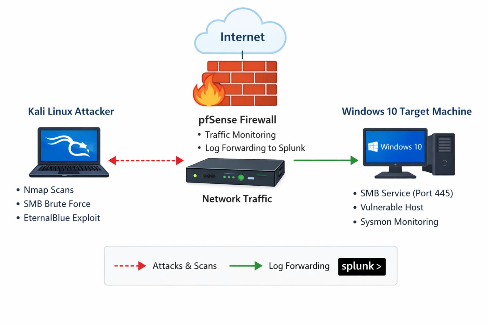

# SOC Analyst Home Lab Project

## Overview
This project demonstrates a complete SOC (Security Operations Center) home lab environment used to simulate real-world cyber attacks and detect them using Splunk.

The lab includes attack simulation, log collection, and detection analysis. 

---

## Lab Architecture

- Attacker Machine: Kali Linux  
- Firewall/Router: pfSense  
- SIEM: Splunk Enterprise  
- Victim: Windows 10
  
---

## Network Design

- pfSense connected to:
  - NAT (Internet access)
  - Host-Only network (vmnet1 internal lab) and Host-Only (vmnet2 internal lab) 

- Kali Linux:
  - Connected to Host-Only vmnet2

- Splunk + Victims:
  - Connected to Host-Only vmnet1
  - Receive internet through pfSense

---

## Network Diagram



---

## Tools Used

- Nmap
- Metasploit Framework
- Splunk Enterprise
- Sysmon
- pfSense

---

## Log Collection

- pfSense firewall configured to forward system logs to Splunk via syslog (UDP 514)
- Primary visibility of all attack activity was obtained from pfSense logs (network-level monitoring)

- Windows endpoints configured with Sysmon and Splunk Universal Forwarder (limited visibility observed)

### Logs Observed in Splunk

- pfSense Logs:
  - Detected network traffic from attacker machine (Kali Linux)
  - Logged connection attempts to target systems
  - Observed activity on key ports such as:
    - Port 445 (SMB)
    - Port 137 (NetBIOS)
  - Source identified as attacker IP
  - Consistent log source: `UDP:514`, sourcetype: `pfsense`

- Windows / Sysmon Logs:
  - Limited or no direct Event ID visibility (e.g., Event ID 3 or 4625 not explicitly observed)
  - Indicates that most attack activity was captured at the firewall level rather than endpoint level
---

## Attack Simulations

### 1. Nmap Port Scan
- Reconnaissance attack to identify open ports

📁 [View Details](attacks/nmap-scan/README.md)

---

### 2. SMB Brute Force Attack
- Credential attack using repeated login attempts

📁 [View Details](attacks/smb-brute-force/README.md)

---

### 3. EternalBlue Exploit (MS17-010)
- Remote code execution via SMB vulnerability

📁 [View Details](attacks/eternalblue/README.md)

---

## Detection Strategy

Splunk was used to detect:

- Port scanning behavior
- Brute-force login attempts
- Suspicious SMB exploitation traffic

Detection was based on analysis of pfSense firewall logs in Splunk.

Key indicators used include:

- Source IP identification (attacker machine)
- Destination IP (target systems)
- Destination ports (e.g., 445 for SMB, 137 for NetBIOS)
- High frequency of connection attempts
- Multiple connections to different ports (port scanning behavior)

Attack patterns were identified by observing unusual traffic behavior and repeated connection attempts from a single source.

---

## Screenshots

All screenshots used in this project are stored in:

```
/screenshots/
```

---

## Key Skills Demonstrated

- Network security monitoring
- SIEM (Splunk) usage
- Threat detection and analysis
- Log analysis (Sysmon & Windows logs)
- Attack simulation using Kali Linux

---

## Author

SOC Analyst Home Lab Project by Anthony Odey
