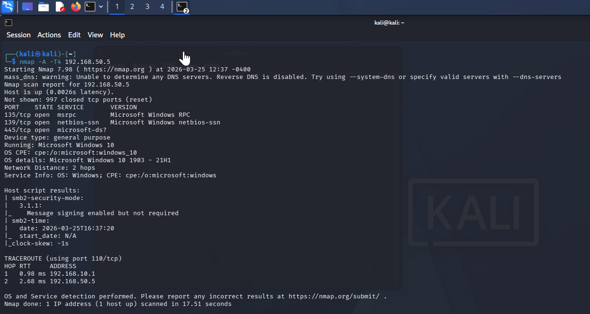
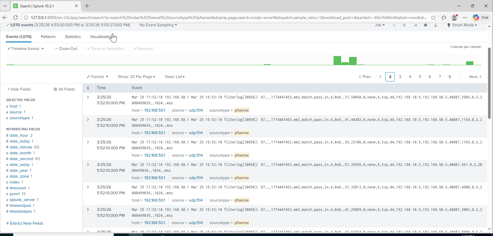

# Nmap Port Scan

## Attack Type
Reconnaissance

## Description
This attack scans the target system to discover open ports and services.

## Command Used
```bash
nmap -A -T4 192.168.50.5
```

## Attack Evidence
The scan reveals open ports such as 135, 139 and 445 on the target.

### Command Execution


### Detection in Splunk


## Detection queries in Splunk
```spl
index=firewall sourcetype=pfsense source=udp:514
```

## Detection Logic
A single source IP connecting to multiple ports on a target indicates a port scan.
