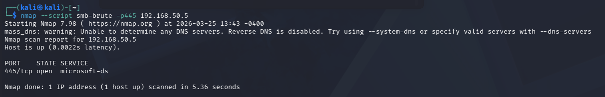
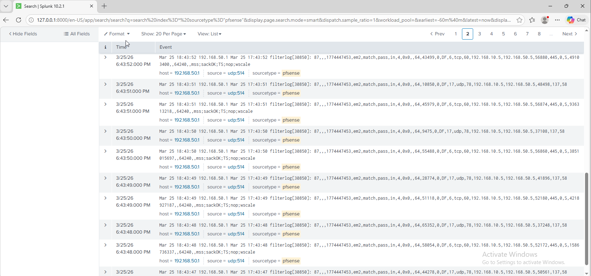

# SMB Brute Force Attack

## Attack Type
Credential Access

## Description
This attack attempts multiple login combinations against SMB to gain unauthorized access.

## Command Used
```bash
nmap --script smb-brute -p445 192.168.50.5
```

## Attack Evidence
Multiple failed login attempts are generated against the target system.

### Command Execution


### Detection in Splunk


## Detection queries in Splunk
```spl
index=firewall ("445" OR "137") 
```

## Detection Logic
Multiple failed login attempts from a single IP indicate brute-force activity.
